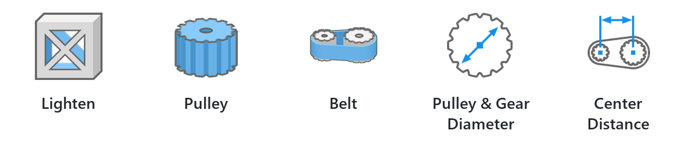
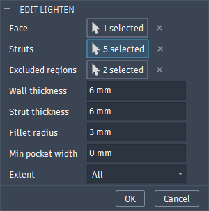
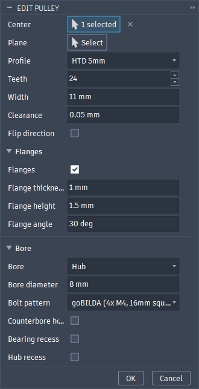
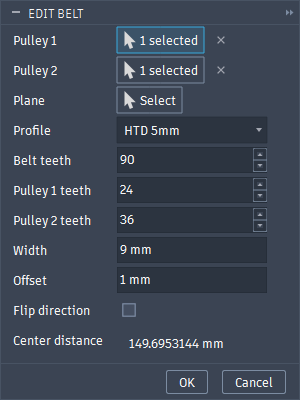
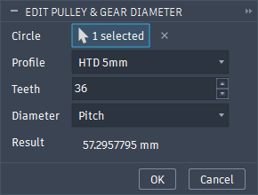
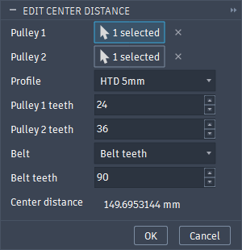

# FTCTools

<div align="center">

<picture>
  <source media="(prefers-color-scheme: dark)" srcset="docs/images/tools-dark.png">
  
</picture>

</div>

Parametric tools for FTC robot design in Autodesk Fusion. Everything acts as its own feature/tool inside of Fusion. The custom features show up in the timeline and are editable after the fact. The sketch tools act as their own "constraints" as well and are editable once applied by double clicking.

## Features

- A better lighten tool that works similarly to the one in Onshape, letting you choose the sizes and strut lines. It's fast and parametric, so you don't need to delete the feature and restart after every change like the FRCTools one.
- Custom generated pulleys, automatic flanges, bores, bearing and hub cutouts, and automatic sequential bridging in the counterbores for clean printing.
- Custom belts, you can choose to make them at the pulleys themselves, or generate and constrain it after the fact. Pick two pulleys and it works out the closest belt tooth count for you. 
- Pulley/gear diameter tool in the sketch workspace, select the pulley profile or gear with the module to dimension a circle to the outer, pitch, or root diameters.
- C to C tool in the sketch workspace to calculate C to C distance between pulleys. Seamlessly works with the pulley/gear tool by filling in parameters when you click two circles dimensioned with the pulley diameter tool.
- Everything is linked. Build a pulley or belt off your sketch and it follows it: change a tooth count, a profile or a belt length in the sketch and the pulleys and belts update with it.
- Works off circular edges and faces too, so you can drop a pulley or belt right on an imported goBILDA pulley or hub.


## Install

Download `FTCTools-0.1.zip` from the [releases page](https://github.com/jackwangxyw/FTCTools/releases) and unzip it. The file works for both Windows and Mac. After downloading and unzipping, you can either:

- **Link it from Fusion.** Open Scripts and Add-Ins (Shift+S), click the + next to Add-Ins, and pick the `FTCTools` folder. Keep the folder somewhere it won't get deleted, since Fusion loads it from there.
- **Or move it into Fusion's add-in folder**, and restart Fusion:
  - Windows: `%APPDATA%\Autodesk\Autodesk Fusion 360\API\AddIns`
  - macOS: `~/Library/Application Support/Autodesk/Autodesk Fusion 360/API/AddIns`

It starts with Fusion from then on. If it doesn't, find FTCTools under Add-Ins in Scripts and Add-Ins, run it, and turn on Run on Startup.

To update, replace the folder with the new one and restart Fusion. To remove it, stop it in Scripts and Add-Ins and delete the folder.

## If you can't find them for whatever reason

An **FTC TOOLS** panel on the Solid tab toolbar has Lighten, Pulley and Belt. While you're editing a sketch, an FTC TOOLS panel on the Sketch tab toolbar has Pulley & Gear Diameter and Center Distance.

## Solid tools

###  Lighten

Pockets a planar face, leaving a wall around its edges and struts along sketch curves.



- **Face**: the planar face to pocket.
- **Struts**: sketch lines, arcs and circles to leave material along.
- **Excluded regions**: sketch profiles to leave solid, with a wall around them. Use these for bosses, bearing holes etc if they are not already auto excluded.
- **Wall thickness**, **Strut thickness**, **Fillet radius**: Wall thickness sets the thickness of the wall, strut thickness sets the thickness of the struts, choose these based on the material you are working with. Set the fillet radius slightly bigger than your endmill radius.
- **Min pocket width**: cuts off pocket fingers and channels narrower than this. 0 turns it off.
- **Extent**: All (through the whole body), Distance, or To object.

The strut and excluded region sketches have to be parallel to the face and in the same component as it. They don't have to be on the face itself.

###  Pulley

A timing pulley generator: GT2 2mm, GT2 3mm, HTD 3mm or HTD 5mm, 6 to 400 teeth.



- **Center**: a sketch point or circle (the pulley sits on its sketch plane), a circular edge, arc or round face (the pulley sits on its plane, building outward from the body), or any point, vertex or construction point together with a plane or planar face. On a face it builds outward from the body.
  - Picking a circle made with Pulley & Gear Diameter fills in its profile and tooth count, and the pulley follows that circle from then on. The **Link** row shows what it's following, like `HTD5_24T`. Type a different tooth count and it stops following.
  - Plain circles, edges and faces are just a center: nothing gets filled in, so you can build on an imported part and pick the values yourself.
- **Clearance**: gives the pulley a slightly looser fit to account for print tolerances. 0.05 mm is a good start for FDM.
- **Flanges**: thickness, height and a bevel angle on the belt side. The toothed width is between the flanges. Keep in mind that thickness and height affect the max bevel angle you can do. 30 degrees is a pretty aggressive minimum, but depends on the overhang angles your printer can produce.
- **Bore**: None, Round, Hex (across flats), or Hub. Hub adds a bolt pattern for a motor or shaft hub: goBILDA (4x M4 on a 16 mm square), REV (4x M3 on a 16 mm circle), or custom.
  - **Counterbore holes** put screw heads on the end away from the hub, with optional **sequential bridging** layers so the counterbore prints cleanly facing the bed.
  - **Bearing recess** cuts a bearing pocket into one end, and **Hub recess** a pocket for the hub itself. Each has a flip to pick the side they sit on.
- **Flip direction**: builds the other way off the plane.

The component, body and timeline feature are named after the pulley, like `HTD5 24T`, and the names update when a linked tooth count or profile changes (unless you renamed them yourself). Moving the center point moves the pulley. You can also make one at the origin and place the component with joints or constraints.

If the center is inside a part inserted from another design (like a goBILDA pulley), the new component goes next to that part in its assembly, since Fusion can't add anything inside it.
###  Belt

A closed timing belt around two pulleys or standalone as its own component.



- **Pulley 1**: a Pulley, or a center picked the same way as for Pulley (sketch point or circle, circular edge or face, or a point with a plane). Click anywhere on a pulley generated with the pulley tool and it selects that pulley, copies its profile, tooth count and side, and sets an offset that centers the belt on its teeth.
- **Pulley 2**: optional, a Pulley or a center to point the belt toward. Without it the belt runs along the plane's x axis.
- **Belt teeth**, **Pulley 1 teeth**, **Pulley 2 teeth**: the center distance is built from these and is shown in the dialog. 
- **Width**: The width of the belt, duh. Changing it re-centers the belt on pulley 1.
- **Offset**: from the plane, e.g. a flange thickness
- **Flip direction**: pretty self explanatory

What it fills in depends on what you pick:

- **Two circles with a Center Distance between them**: everything comes from the center distance, and the belt follows it (tooth counts, belt teeth or length, profile).
- **Two pulleys, or any two centers**: the pulley teeth come from the pulleys, and **Belt teeth** becomes the closest whole belt for the distance between them. That belt keeps re-solving when the pulleys move. Type your own belt tooth count to lock it.

A real belt has a whole number of teeth, so the belt is built to its own exact center distance. If that's more than 0.1 mm off from where pulley 2 actually is, the belt turns yellow in the timeline and the **Status** row says how far off it is. Fix it with a Center Distance in your sketch, or by moving the pulleys.

The belt's teeth are the pulley grooves at zero clearance, so belt and pulley match by construction.

## Sketch tools

These dimension plain sketch circles and points, so you can lay out a drivetrain before any parts exist. They're driven by user parameters, so changing a tooth count in Change Parameters resizes the circles and moves the centers.

To edit any of their dimensions, double-click it, or right-click it and pick Edit. The dialog comes back with what it was made with.

###  Pulley & Gear Diameter

Dimensions a sketch circle as a pulley's or gear's pitch, outside or root diameter. Pick the circle, the profile, the tooth count and which diameter.



The tooth count becomes a user parameter named for the part, like `HTD5_24T` (a second 24T HTD5 pulley gets `HTD5_24T_2`), and the circle's diameter is an expression on it.

| Profile | Pitch | Outside | Root |
| :--- | :--- | :--- | :--- |
| Timing pulley | `N * pitch / PI` | pitch - 2 * PLD | outside - 2 * tooth depth |
| Gear, module m | `N * m` | `(N + 2) * m` | `(N - 2.5) * m` |

Gears are standard spur gears, but will work for herringbones and double herringbones as well: addendum 1 m, dedendum 1.25 m, no profile shift. The tooth count parameter for a gear is named like `M1_5_24T` for module 1.5.

Changing a circle's profile renames its parameter and switches every circle connected to it through center distances to the same profile, since they share belts. The center distances, pulleys and belts on them all follow.

###  Center Distance

Dimensions two points or circles (their centers), or two parallel lines, to the center distance for a belt.



Pick the profile, both pulleys' tooth counts and the belt, either as a tooth count or a pitch length. The center distance goes in a user parameter named `CC1`, `CC2`, ..., and the dimension just reads `CC1`. Belt teeth or length go in `CC1_BeltTeeth` or `CC1_BeltLength`.

Picking circles made with Pulley & Gear Diameter fills in their profile and tooth count, and the center distance uses their parameters directly. Change a pulley's tooth count and the circle resizes and the centers move with it.

Belts made on a center distance follow it. With a belt length instead of a tooth count, the belt uses the closest whole number of teeth (and turns yellow if that's off by more than 0.1 mm).


## Building

`build.sh` (Git Bash on Windows) packages whatever version is in `FTCTools.manifest`:

```sh
./build.sh
```

It writes `build/FTCTools-<version>.zip`, and needs [jq](https://jqlang.org/) and [7-Zip](https://www.7-zip.org/).

To work on the code, link the repo folder itself in Scripts and Add-Ins instead of a release. A release and the repo copy have the same add-in id, so don't run both at once.

## Bugs

This is beta software. If something breaks, please open a GitHub issue with the error message and what you clicked.
